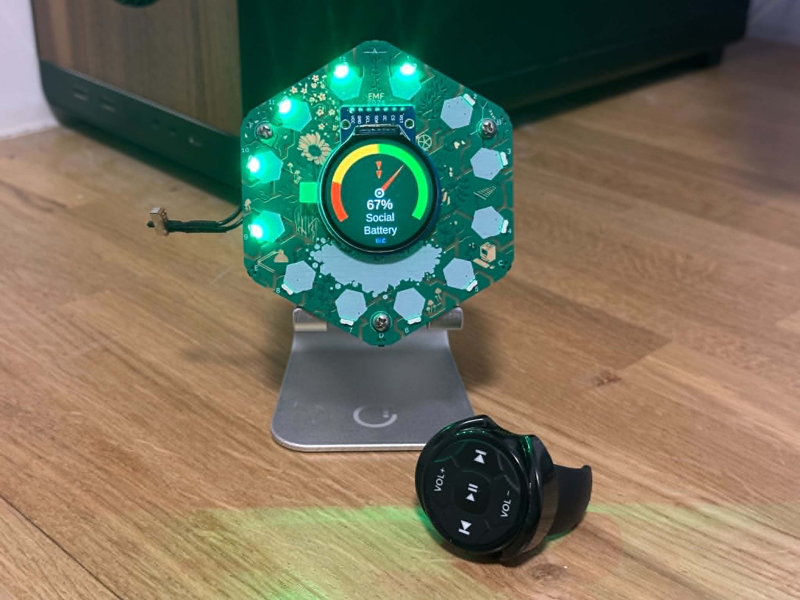

# Social Battery — Tildagon Badge App

A car fuel-gauge for your social energy. Displays a sweeping needle and 12 RGB LEDs on the [Tildagon](https://tildagon.badge.emfcamp.org/) ESP32-S3 badge from EMF Camp 2024, auto-draining or charging at a configurable rate to reflect how you feel in social situations. Supports a BLE media remote for hands-free control.

> Created by **Yale32** · [youtube.com/@yale32](https://www.youtube.com/@yale32)



---

## Contents

- [Overview](#overview)
- [Installation](#installation)
- [Display](#display)
- [Controls — Badge Buttons](#controls--badge-buttons)
- [Controls — BLE Remote](#controls--ble-remote)
- [BLE Firmware Requirements](#ble-firmware-requirements)
- [About](#about)

---

## Overview

Social Battery shows your current social energy level as a percentage on the badge's 240×240 round display. The needle sweeps across a colour-coded arc (red → orange → green), and the 12 outer LEDs mirror the level in real time.

The level auto-updates at a rate you control — from a gentle 1% every 30 seconds up to a rapid 1% per second burst. You can also nudge it manually, pause it, or flip the direction between draining and charging. All of this is controllable from the badge buttons or from a paired BLE media remote clipped to your pocket.

---

## Installation

### From the app store

Install directly from the Tildagon app store — no computer needed.

### Manual install via mpremote

#### Prerequisites

```bash
pip install mpremote
```

If you get `Permission denied` on `/dev/ttyACM*`, prefix every `mpremote` command with `sg dialout -c "..."`.

#### Standard install (no BLE)

The app runs on stock Tildagon firmware. Copy the files and reboot:

```bash
mpremote mkdir :/apps
mpremote mkdir :/apps/social_battery
mpremote cp app.py       :/apps/social_battery/app.py
mpremote reset
```

The BLE remote features are silently skipped if the `bluetooth` module is not available — everything else works normally.

#### With BLE remote support

BLE requires custom firmware (see [BLE Firmware Requirements](#ble-firmware-requirements)). Once the firmware is flashed, deploy both files:

```bash
mpremote mkdir :/apps
mpremote mkdir :/apps/social_battery
mpremote cp app.py        :/apps/social_battery/app.py
mpremote cp ble_remote.py :/apps/social_battery/ble_remote.py
mpremote reset
```

> **Note:** When BLE is active the ESP32-S3's USB stack shares resources with the radio, which can prevent `mpremote` from opening a REPL. Always reboot the badge (unplug/replug or press reset) before running deploy commands, then open the app afterwards.

---

## Display

### Main gauge screen

```
        ╭─────────────────╮
       /   green arc zone  \
      │  ╭────────────────╮ │
      │  │   orange zone  │ │
      │  │  ╭──────────╮  │ │
      │  │  │ red zone │  │ │
      │  │  │   ╱      │  │ │
      │  │  │  ╱ needle│  │ │
      │  │  │ ●        │  │ │  ← pivot (red dot = paused)
      │  │  │  75%     │  │ │
      │  │  │ Social   │  │ │
      │  │  │ Battery  │  │ │
      │  │  │  BLE     │  │ │  ← blue "BLE" when remote connected
      │  │  ╰──────────╯  │ │
      │  ╰────────────────╯ │
       \                   /
        ╰─────────────────╯
     ● ● ●                ● ● ●     ← outer LEDs (colour matches zone)
```

| Element | Description |
|---------|-------------|
| **Arc** | Sweeps 250° clockwise from lower-left (0%) through the top (50%) to lower-right (100%) |
| **Colour zones** | Red 0–20%, Orange 20–50%, Green 50–100% |
| **Needle** | Red pointer — moves smoothly to current percentage |
| **Pivot dot** | Silver = running · Red = paused |
| **Percentage** | Large number below the pivot |
| **Status arrows** | Flashing arrow(s) above the pivot: 1 = normal, 2 = fast, 3 = burst |
| **BLE indicator** | Small blue "BLE" below the label when remote is connected; grey "BLE?" while scanning |
| **LEDs** | 8 arc LEDs (positions 9→12→1→4) light up proportional to level; 4 rear LEDs stay dark |

### Direction animation

A single LEFT or RIGHT press plays a full-screen scrolling animation before the gauge returns:

- **Charging (RIGHT):** Green arrows scroll upward, "Charging" label at top
- **Draining (LEFT):** Red arrows scroll downward, "Battery under load" label at bottom

### Low-battery warning

When the level drops below 20%, "Charge immediately!!" flashes red three times. To avoid being annoying it only fires on every other decrease while below 20%.

---

## Controls — Badge Buttons

### Intro screen (shown on launch)

| Button | Action |
|--------|--------|
| **A** (UP) | Scroll up |
| **D** (DOWN) | Scroll down |
| **C** (CONFIRM) | Dismiss intro and start the app |

### Main app

| Button | Action |
|--------|--------|
| **UP** | Manual +1% |
| **DOWN** | Manual −1% |
| **CONFIRM** | Toggle pause / resume |
| **CANCEL** | Close app |

### LEFT / RIGHT — direction and speed

These buttons use click-sequence detection. All clicks must land within a **650 ms window**; the action fires when the window closes (or immediately on the 3rd click).

| Clicks | Direction | Auto-update rate | Visual |
|--------|-----------|-----------------|--------|
| Single | Set direction | 1% every 30 s | Scrolling arrow animation |
| Double | Set direction | 1% every 10 s | None |
| Triple | Set direction | 1% every 1 s for 5 ticks, then reverts to 30 s | Animation then burst |

Pressing the opposite direction always resets to single-press (30 s) in the new direction.

---

## Controls — BLE Remote

### Supported device

**Jetion Remote V3.0** — a compact BLE HID media remote. Any BLE device that advertises UUID `0x1812` (HID over GATT) and sends standard Consumer Control usage codes should also work.

### Button mapping

| Remote button | HID code | Action |
|---------------|----------|--------|
| **Vol +** | `0xE9` | Manual +1% |
| **Vol −** | `0xEA` | Manual −1% |
| **Play/Pause** | `0xCD` | Toggle pause |
| **Next** | `0xB5` | Set charging direction |
| **Prev** | `0xB6` | Set draining direction |

### Speed modes via Next / Prev

Next and Prev support the same single / double / triple click sequences as the badge buttons, with a slightly wider **1.0 s window** to accommodate the physical remote:

| Clicks | Rate |
|--------|------|
| Single | 1% every 30 s |
| Double | 1% every 10 s |
| Triple | 1% every 1 s for 5 ticks |

The click counter resets after each committed sequence, so one press after a double always starts fresh as a single.

### Connection

The app starts scanning for BLE HID devices automatically on launch. When a device is found it connects, discovers the HID service, and subscribes to all Report characteristics. The blue "BLE" label appears on the gauge when fully connected. If the remote goes out of range or disconnects, the app resumes scanning automatically.

### How BLE works under the hood

1. **Scanning** — `gap_scan` runs indefinitely, filtering advertisement payloads for UUID `0x1812` (HID). On a match, scanning stops and a connection is initiated.

2. **Service discovery** — After connecting, the HID service (UUID `0x1812`) is discovered, then all characteristics within it.

3. **Subscribing to notifications** — For each Report characteristic (UUID `0x2A4D`) that supports Notify or Indicate, the app writes to the **CCCD at handle `value_handle + 1`**. Descriptor-range discovery was skipped because the Jetion's GATT server has an unusual structure where handle ranges span across characteristics; writing directly to `val_h + 1` is more reliable and is valid for all well-formed HID servers.

4. **Sequential CCCD writes** — All CCCD writes are queued and issued one at a time, each triggered by the `IRQ_GATTC_WRITE_DONE` callback of the previous write. Writing multiple CCCDs simultaneously causes `ENOMEM` on the ESP32-S3 BLE stack.

5. **Protocol Mode** — UUID `0x2A4E` (Protocol Mode) is written with `0x01` (Report Protocol) immediately after characteristic discovery. This ensures the remote sends structured HID Report notifications rather than Boot Protocol data.

6. **Key-repeat debounce** — HID remotes send repeated key-down events while a button is held, followed by a key-up (`0x00`). The app passes `0x00` through the callback chain and uses it to clear a `_ble_key_held` flag, so only the first key-down event per physical press is acted on.

7. **IRQ safety** — The BLE callback (`_on_ble_key`) runs in the MicroPython BLE IRQ context. It only sets simple flags and integers — the actual state changes happen in the main `update()` loop on the next frame.

---

## BLE Firmware Requirements

### The problem

The stock Tildagon firmware ships with Bluetooth **disabled** at the MicroPython build level. Calling `import bluetooth` raises `ImportError`, and `bluetooth.BLE().active(True)` causes a hard reset. The Social Battery app handles this gracefully — it catches the error and disables the BLE remote silently — but to actually use BLE you need a custom firmware build.

### What to enable

In the MicroPython port configuration file:

**`tildagon/mpconfigboard.h`**

```c
#define MICROPY_PY_BLUETOOTH  (1)   // ← add this line
```

This single flag links the MicroPython `bluetooth` module into the build and enables the ESP-IDF BLE stack.

### Option A — Use the pre-built binary

A pre-built firmware with BLE enabled is available in the [releases](https://github.com/yale32/social-battery-tildagon/releases) section.

Flash it with esptool:

```bash
pip install esptool

esptool.py --chip esp32s3 --port /dev/ttyACM0 \
    write_flash 0x0 merged-firmware.bin
```

To enter bootloader mode: hold all six badge buttons for ~20 seconds, then reconnect USB.

### Option B — Build from source

Requires Docker.

```bash
git clone --recursive https://github.com/emfcamp/badge-2024-software
cd badge-2024-software

# Apply patches and build
bash scripts/firstTime.sh
docker run --rm -v $(pwd):/src -w /src \
    ghcr.io/emfcamp/badge-2024-build:latest \
    bash -c "cd micropython/ports/esp32 && make BOARD=tildagon -j$(nproc)"
```

Then merge the output binaries into a single image using the addresses from `flasher_args.json`:

```bash
esptool.py --chip esp32s3 merge_bin \
    -o merged-firmware.bin \
    0x0     micropython/ports/esp32/build-tildagon/bootloader/bootloader.bin \
    0x8000  micropython/ports/esp32/build-tildagon/partition_table/partition-table.bin \
    0xd000  micropython/ports/esp32/build-tildagon/ota_data_initial.bin \
    0x10000 micropython/ports/esp32/build-tildagon/micropython.bin
```

Flash `merged-firmware.bin` as above.

> **Important:** After flashing, the ESP32-S3 USB stack and BLE radio share resources. When BLE is active, `mpremote` may fail to open a REPL. Always reboot the badge before deploying files, then reopen the app after.

---

## About

**Yale32**

- YouTube: [youtube.com/@yale32](https://www.youtube.com/@yale32)

The badge itself is the [Tildagon](https://tildagon.badge.emfcamp.org/) from [Electromagnetic Field](https://www.emfcamp.org/) Camp 2024 — an open-source, reusable ESP32-S3 platform for future events.
